<p align="center">
  
</p>

<h1 align="center">OneSoul.AI</h1>

<p align="center">
  <strong>Experimental AI matchmaking with autonomous personas, compatibility evaluation, and verifiable conversation results.</strong>
</p>

<p align="center">
  
  
  
  
  
  
  
</p>

---

## Overview

**OneSoul.AI** is a Django prototype exploring AI-assisted matchmaking through **digital personas**.

The current demo lets two AI personas converse with each other over multiple rounds. A separate **Cupid** agent then evaluates the full conversation, produces a compatibility decision, score, summary, and first-date suggestion, and stores the result in the database.

The project also contains an experimental **Flare Data Connector (FDC)** verification path that prepares a JSON API attestation for the latest stored match result and submits the resulting proof to a smart contract.

At a high level:

```text
AI persona A
      \
       > conversation → Cupid evaluation → database → Flare verification
      /
AI persona B
```

> [!NOTE]
> This repository is an experimental prototype. Several screens and flows are mockups or partially wired, and the project should not be treated as a production matchmaking, identity, or blockchain application.

---

## Core Idea

The product concept presented by the application is:

1. build a profile or digital representation of a person;
2. let AI agents interact on behalf of potential matches;
3. evaluate compatibility from the conversation;
4. preserve a deterministic hash of the match result;
5. optionally attest the result through Flare infrastructure.

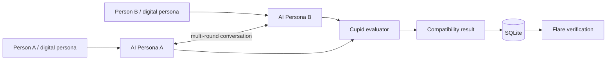

---

## Current Demo Flow

The included demo currently uses two predefined AI personas and a browser-driven conversation loop.

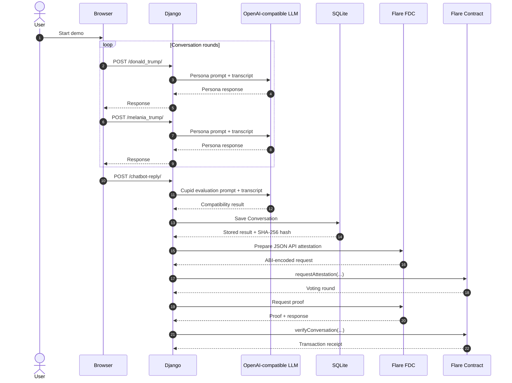

---

## System Architecture

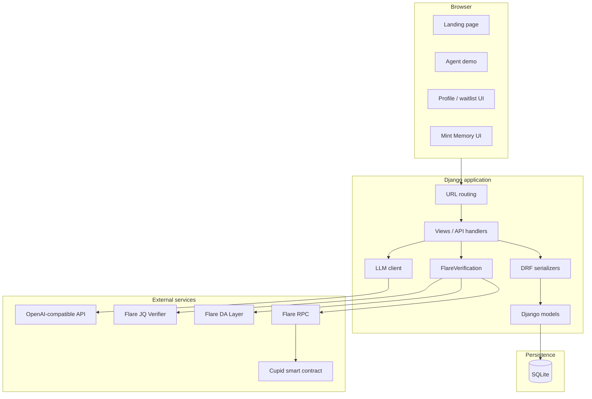

---

## Main Features

### AI-to-AI matchmaking

The demo runs a scripted multi-round conversation between two personas.

Each round:

- sends the complete conversation history to the first persona;
- appends its response;
- sends the updated history to the second persona;
- appends that response;
- continues until the browser reaches the evaluation stage.

### Cupid compatibility evaluation

After the conversation, the `chatbot_reply` endpoint asks the LLM to return a structured compatibility result containing:

- `compatible`
- `score`
- `summary`
- `first_date`

That result is persisted as a `Conversation`.

### Conversation hashing

Every saved conversation receives a SHA-256 hash derived from:

- both matched users;
- full conversation;
- compatibility score;
- summary;
- compatibility verdict.

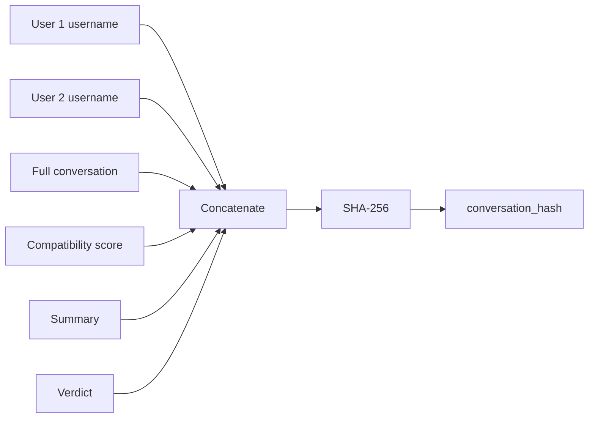

### Flare verification

`FlareVerification` implements an experimental verification path using:

- an `IJsonApi` attestation;
- `WEB2` as the source type;
- a JQ verifier;
- Flare's data availability layer;
- a configured RPC endpoint;
- a Cupid smart contract.

The data selected from the latest conversation includes the matched profile IDs, verdict, score, conversation ID, timestamp, and conversation hash.

### Django web UI

The project includes server-rendered templates for:

- the OneSoul.AI landing page;
- the AI-agent demo;
- profile/waitlist UI;
- the experimental "Mint Memory" screen.

---

## Flare Attestation Flow

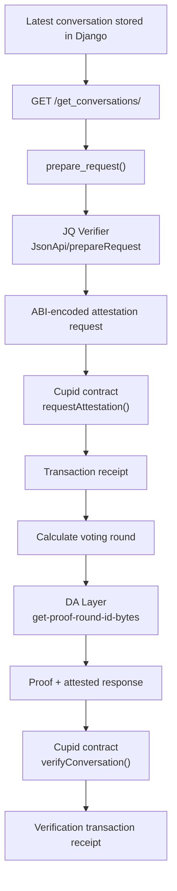

The verification helper currently pays **1 FLR-equivalent unit in wei configuration** when building the attestation request transaction:

```python
"value": self.w3.to_wei(1, "ether")
```

Check the target network, contract requirements, and testnet funding before executing this flow.

---

## Data Model

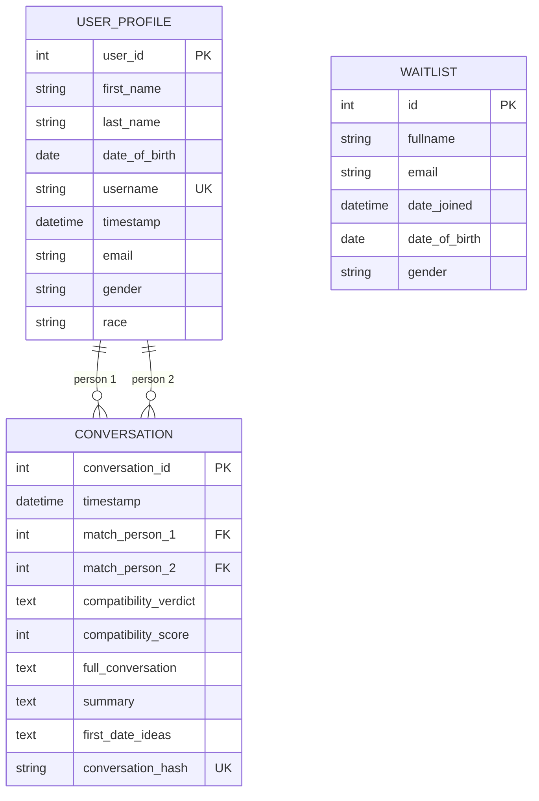

### `UserProfile`

Represents a user profile with demographic and identifying information.

Important fields include:

| Field | Purpose |
|---|---|
| `user_id` | Primary key |
| `username` | Unique persona/user identifier |
| `first_name`, `last_name` | Display identity |
| `date_of_birth` | Profile metadata |
| `email` | Contact/profile field |
| `gender` | Profile metadata |
| `race` | Optional profile metadata |
| `timestamp` | Creation time |

### `Conversation`

Stores the result of a matchmaking conversation.

| Field | Purpose |
|---|---|
| `match_person_1` | First `UserProfile` |
| `match_person_2` | Second `UserProfile` |
| `compatibility_verdict` | Match / cut-style result |
| `compatibility_score` | Numeric compatibility score |
| `full_conversation` | Serialized transcript |
| `summary` | LLM-generated compatibility summary |
| `first_date_ideas` | Suggested first date |
| `conversation_hash` | Unique SHA-256 digest |
| `timestamp` | Creation time |

### `Waitlist`

A separate lightweight model containing:

- full name;
- email;
- date joined;
- date of birth;
- gender.

The current `/waitlist/` template is labelled as profile creation and does not currently persist this model.

---

## Repository Structure

```text
onesoul_webapp/
├── main/
│   ├── migrations/
│   ├── static/
│   │   ├── images/
│   │   │   ├── logo.png
│   │   │   └── logo1.png
│   │   ├── messaging_icon.png
│   │   └── x_icon.png
│   ├── templates/
│   │   ├── main/
│   │   │   ├── demo.html
│   │   │   ├── landing-page.html
│   │   │   ├── mint-memory.html
│   │   │   └── waitlist.html
│   │   └── partials/
│   ├── admin.py
│   ├── apps.py
│   ├── flare_verification.py
│   ├── models.py
│   ├── serializers.py
│   ├── tests.py
│   ├── urls.py
│   └── views.py
├── onesoul_test/
│   ├── asgi.py
│   ├── settings.py
│   ├── urls.py
│   └── wsgi.py
├── db.sqlite3
├── manage.py
├── requirements.txt
└── README.md
```

---

## Tech Stack

| Layer | Technology |
|---|---|
| Backend | Django 5.1.5 |
| API serialization | Django REST Framework 3.15.2 |
| LLM client | OpenAI Python SDK |
| HTTP | Requests / HTTPX |
| Database | SQLite |
| Configuration | `python-dotenv` |
| Static serving | WhiteNoise |
| Verification | Flare FDC + Web3 |
| Smart-contract client | `web3.py` / `eth-account` |
| Frontend | Django templates + vanilla HTML/CSS/JavaScript |

---

## Routes

| Method | Route | Purpose | Current state |
|---|---|---|---|
| `GET` | `/` | Landing page | Implemented |
| `GET` | `/demo/` | AI-to-AI matchmaking demo | Implemented prototype |
| `POST` | `/donald_trump/` | Generate first demo persona response | Implemented |
| `POST` | `/melania_trump/` | Generate second demo persona response | Implemented |
| `POST` | `/chatbot-reply/` | Cupid evaluation, persistence, Flare verification | Implemented prototype |
| `POST` | `/register/` | Create a `UserProfile` via serializer | Implemented API |
| `GET` | `/get_conversations/` | Return latest stored conversation result | Implemented |
| `GET` | `/waitlist/` | Profile/waitlist screen | UI-only prototype |
| `GET` | `/mint-memory/` | "Mint Memory" screen | Simulated UI only |
| `GET` | `/admin/` | Django admin | Django default |

---

## API Flow

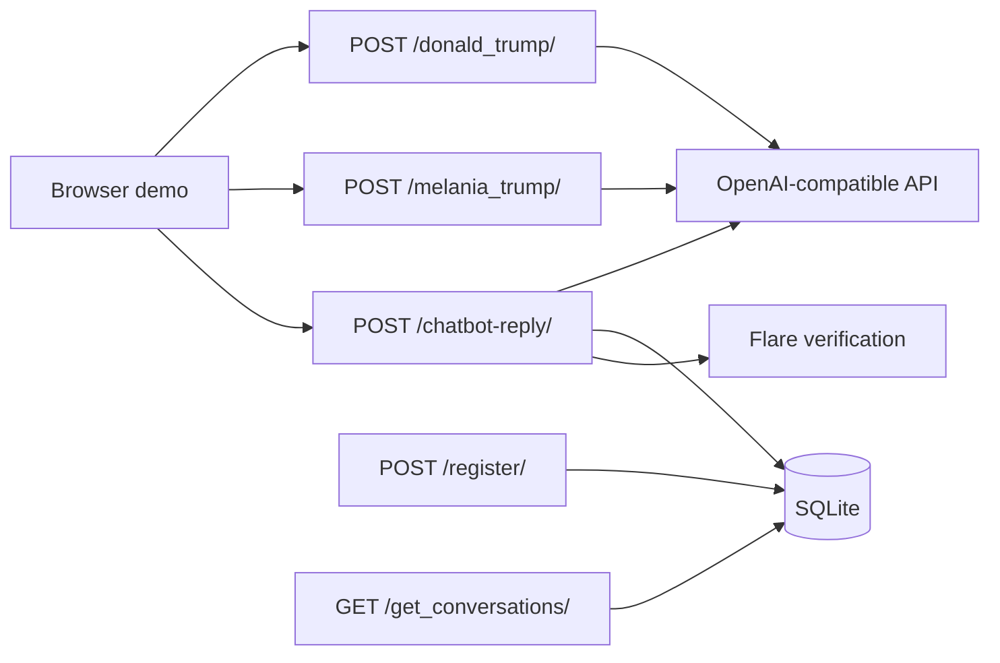

---

## Local Setup

### 1. Clone the repository

```bash
git clone https://github.com/Ultraviolet-Chikorita/onesoul_webapp.git
cd onesoul_webapp
```

### 2. Create a virtual environment

#### Windows

```powershell
python -m venv .venv
.venv\Scripts\activate
```

#### Linux / macOS

```bash
python3 -m venv .venv
source .venv/bin/activate
```

### 3. Install the declared dependencies

```bash
pip install -r requirements.txt
```

### 4. Install the Flare/Web3 dependencies

`main/flare_verification.py` imports `web3` and `eth_account`, but they are **not currently listed in `requirements.txt`**.

Install them separately:

```bash
pip install web3 eth-account
```

A cleaner project setup would add these packages to `requirements.txt`.

### 5. Configure environment variables

Create a `.env` file in the repository root.

```dotenv
# LLM
OPENAI_API_KEY=
OPENAI_API_URL=

# Alternative provider configuration currently loaded by the code
DEEPSEEK_API_KEY=
DEEPSEEK_API_URL=

# Flare / FDC
FLARE_RPC_URL=
CUPID_CONTRACT_ADDRESS=
PRIVATE_KEY=
JQ_VERIFIER_URL_TESTNET=
DA_LAYER_URL_COSTON=
JQ_API_KEY=
```

For the standard OpenAI service, `OPENAI_API_URL` can normally be left unset unless a custom OpenAI-compatible endpoint is required.

> [!CAUTION]
> `PRIVATE_KEY`, API keys, and Django secrets must never be committed to source control.

### 6. Apply migrations

```bash
python manage.py migrate
```

### 7. Run the development server

```bash
python manage.py runserver
```

Open:

```text
http://127.0.0.1:8000/
```

---

## LLM Configuration

The application creates an OpenAI-compatible client using:

```python
client = OpenAI(
    api_key=OPENAI_API_KEY,
    base_url=OPENAI_API_URL,
)
```

Although `call_llm_api()` exposes a `model` argument, the current implementation overrides it internally:

```python
model = "gpt-4o-mini"
```

The function's supplied temperature and token parameters are also currently replaced by fixed values in the actual API call.

The DeepSeek environment variables are loaded, but the DeepSeek client configuration is commented out.

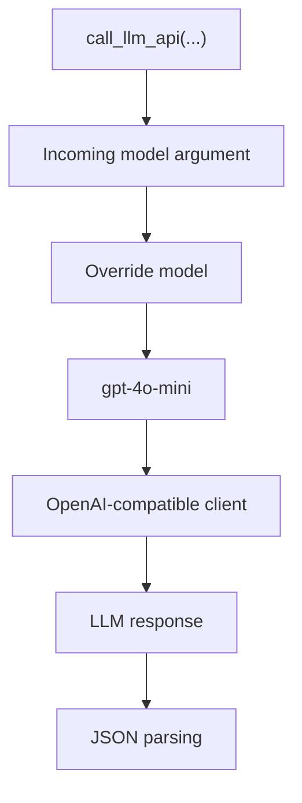

---

## Cupid Evaluation

The final demo stage expects the LLM to produce a structure conceptually equivalent to:

```json
{
  "role": "cupid_evaluation",
  "reply": {
    "compatible": "MATCH",
    "score": 87,
    "summary": "Compatibility summary...",
    "first_date": "Suggested date..."
  }
}
```

The inner `reply` object is mapped into a `Conversation` record.

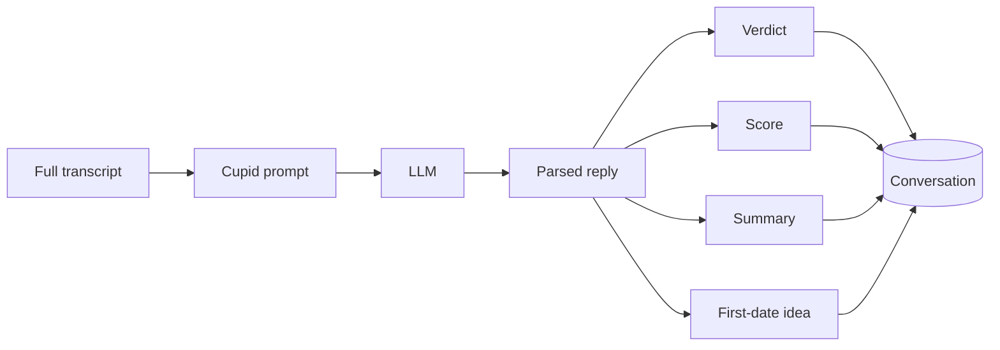

---

## Demo Personas

The current browser demo is hard-coded around two example persona endpoints:

```text
/donald_trump/
/melania_trump/
```

Each endpoint supplies a long system prompt defining the persona's tone, preferences, and matchmaking behaviour.

The browser also references these hard-coded database usernames during final evaluation:

```text
MAGA_Trump
melania_trump
```

Those corresponding `UserProfile` records therefore need to exist for the demo's final evaluation path to succeed.

The persona implementation should be understood as **demo scaffolding**, not as a general persona system.

---

## Current Implementation Status

### Working or substantially implemented

- Django landing page
- server-rendered demo interface
- LLM persona endpoints
- multi-round browser conversation
- Cupid compatibility evaluation
- `UserProfile` persistence endpoint
- `Conversation` persistence
- SHA-256 conversation hashes
- latest-conversation JSON endpoint
- Flare verification helper
- WhiteNoise static-file configuration

### Prototype / incomplete

- profile creation UI
- waitlist persistence
- Mint Memory functionality
- NFT generation path
- general-purpose digital twin creation
- production authentication
- production blockchain configuration
- automated test coverage

---

## Important Current Limitations

| Area | Current behaviour | Recommended change |
|---|---|---|
| Django secret | A Django secret key is committed in `settings.py` | Rotate it and load it from environment |
| Debug mode | `DEBUG = True` | Disable in production |
| Flare dependencies | `web3` / `eth-account` are imported but absent from `requirements.txt` | Add and pin dependencies |
| Demo identities | Final evaluation uses hard-coded usernames | Select profiles dynamically |
| Persona system | Persona endpoints are hard-coded | Represent personas as data/configuration |
| LLM model | Function argument is overwritten with `gpt-4o-mini` | Honour configuration |
| LLM parsing | Assumes model output is valid JSON | Use structured output/schema validation |
| CSRF | Multiple JSON endpoints use `@csrf_exempt` | Add deliberate API authentication / CSRF strategy |
| Authentication | Public API handlers have no application-level auth | Add access control |
| Error handling | Several broad `except Exception` blocks | Return structured errors and log safely |
| API output | Flare success path returns transaction details instead of the Cupid `reply` expected by the current browser code | Separate evaluation response from verification status |
| Async model | `asyncio.run()` is called from a synchronous Django request | Refactor the verification integration |
| Flare helper | Async methods perform blocking `requests` calls | Use sync methods or async HTTP consistently |
| Private key | Server-side transaction signing uses an env private key | Use a secure secret/key-management strategy |
| Waitlist UI | Form submission is prevented and simulated in JavaScript | Connect it to a backend endpoint |
| Profile form | UI fields do not match all required `UserProfile` fields | Align form and serializer schema |
| Mint Memory | Frontend only simulates minting with a timeout | Implement or clearly remove the blockchain action |
| NFT image code | Helper exists but is not active in registration | Decide whether to wire or remove it |
| Latest conversation API | Exposes latest match result without auth | Add permissions if data is sensitive |
| Database | SQLite is committed to the repository | Remove runtime DB from version control for deployment |
| Generated files | `__pycache__` directories are committed | Add/update `.gitignore` |
| Tests | `tests.py` contains no meaningful coverage | Add unit/integration tests |

---

## A Note on the Current Flare Response Path

The current `chatbot_reply` flow performs the Cupid evaluation and saves it before attempting Flare verification.

When Flare verification succeeds, the endpoint returns:

```json
{
  "status": "success",
  "transaction_hash": "...",
  "block_number": 123
}
```

The demo browser, however, currently reads:

```javascript
let cupidReply = dataCupid.reply;
```

That means the successful Flare branch and the browser's expected response shape are currently inconsistent.

A cleaner API shape would keep both results:

```json
{
  "reply": {
    "compatible": "MATCH",
    "score": 87,
    "summary": "...",
    "first_date": "..."
  },
  "verification": {
    "status": "success",
    "transaction_hash": "...",
    "block_number": 123
  }
}
```

---

## Security Considerations

This repository currently contains development-oriented configuration that should be changed before any deployment.

### Django

The checked-in settings currently include:

- a committed `SECRET_KEY`;
- `DEBUG = True`;
- SQLite as the application database.

Treat the committed secret as compromised and rotate it before deploying anything based on this code.

A production configuration should look conceptually like:

```python
SECRET_KEY = os.environ["DJANGO_SECRET_KEY"]
DEBUG = False
```

### API endpoints

The LLM and registration endpoints currently use minimal request validation, and several are CSRF-exempt.

Before deployment:

- add authentication;
- add authorization;
- validate request schemas;
- rate-limit LLM endpoints;
- restrict the conversation endpoint;
- avoid returning sensitive profile data unnecessarily.

### Blockchain credentials

`FlareVerification` signs transactions using a server-side private key.

Use a dedicated test account during development and never commit the key. For production use, move signing into an appropriate secure key-management or wallet architecture.

### Matchmaking data

The database can contain:

- names;
- email addresses;
- birth dates;
- gender;
- race;
- full AI conversation transcripts;
- generated compatibility analyses.

This data can be sensitive. Any real deployment should define clear consent, retention, access-control, deletion, and privacy policies.

---

## Production-Oriented Architecture

The current prototype places most orchestration directly inside Django views. A more maintainable architecture could separate those concerns:

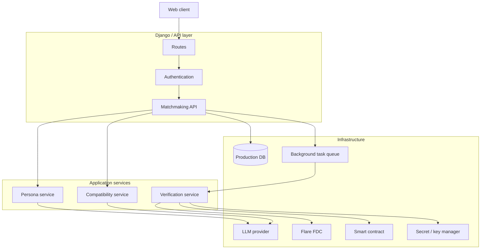

This would allow the user-facing match response to return independently of slower attestation transactions.

---

## Suggested Internal Module Split

If the project is expanded, the current `views.py` can be decomposed without changing the external product concept:

```text
main/
├── api/
│   ├── conversations.py
│   ├── profiles.py
│   └── personas.py
├── services/
│   ├── compatibility.py
│   ├── llm.py
│   └── flare.py
├── models.py
├── serializers.py
├── urls.py
└── views.py
```

The main boundaries would be:

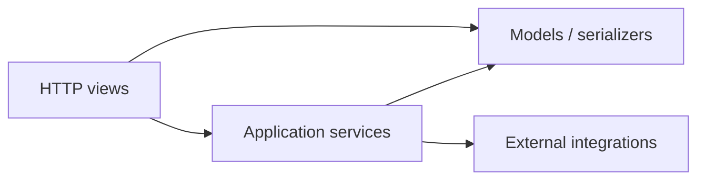

---

## Running the Demo

After installing dependencies, configuring the LLM environment variables, and starting Django:

```bash
python manage.py runserver
```

open:

```text
http://127.0.0.1:8000/demo/
```

The demo's final evaluation currently expects `UserProfile` records with usernames:

```text
MAGA_Trump
melania_trump
```

Without them, `UserProfile.objects.get(...)` will raise an exception when `/chatbot-reply/` runs.

You can create suitable development records through Django shell or the `/register/` API.

---

## Example Profile Registration

`POST /register/` expects data compatible with `UserProfileSerializer`.

Example:

```bash
curl -X POST http://127.0.0.1:8000/register/ \
  -H "Content-Type: application/json" \
  -d '{
    "first_name": "Example",
    "last_name": "Person",
    "date_of_birth": "1995-01-01",
    "username": "example_person",
    "email": "example@example.com",
    "gender": "other",
    "race": ""
  }'
```

Successful registration returns the serialized user.

---

## Latest Conversation Endpoint

`GET /get_conversations/` returns the most recently created `Conversation`.

Example shape:

```json
{
  "match_person_1": 1,
  "match_person_2": 2,
  "compatibility_verdict": "MATCH",
  "compatibility_score": 87,
  "conversation_id": 4,
  "timestamp": "2025-02-09T00:00:00Z",
  "conversation_hash": "..."
}
```

This endpoint is also the Web2 data source used by the current Flare attestation workflow.

---

## "Mint Memory"

`/mint-memory/` presents a UI for:

- selecting an image;
- previewing it;
- entering a DNS domain;
- triggering a "Mint Memory" action.

At present, the mint operation is a client-side simulation implemented with a JavaScript timeout. It does not submit the image or execute a blockchain transaction.

---

## NFT Image Helper

`views.py` contains a `generate_nft_image(username)` helper that calls OpenAI's image-generation endpoint with a prompt based on the username.

The corresponding profile image / NFT model fields and registration integration are currently commented out, so this helper is not part of the active registration flow.

---

## Testing

Run Django's test runner with:

```bash
python manage.py test
```

The repository currently has only the default test module scaffold, so meaningful test coverage still needs to be added.

High-value tests would include:

- `Conversation.save()` hash generation;
- registration validation;
- missing/duplicate user handling;
- LLM response parsing;
- Cupid evaluation schema validation;
- persona endpoints;
- `get_conversations()` behaviour;
- Flare request preparation;
- Flare error handling;
- end-to-end demo response shape.

---

## Deployment Notes

WhiteNoise is installed and configured for static-file serving.

Before deployment:

```bash
python manage.py collectstatic
python manage.py check --deploy
```

Also ensure:

- `DEBUG=False`;
- `SECRET_KEY` comes from the environment;
- production `ALLOWED_HOSTS` is configured;
- SQLite is replaced if the deployment needs concurrent or durable production storage;
- static files build correctly;
- all Flare/Web3 dependencies are pinned;
- private keys and API keys come from a secret manager;
- LLM endpoints are protected from unrestricted public use.

---

## Development Status

**Prototype / experimental**

The repository demonstrates the central OneSoul.AI concept:

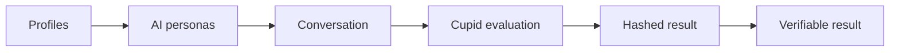

The most developed path is the **agent conversation → compatibility evaluation → stored result → Flare verification** pipeline. Other product surfaces are earlier-stage prototypes.

---

## License

No licence is currently included in the repository.

Until a licence is added, normal copyright restrictions apply to the project source.
