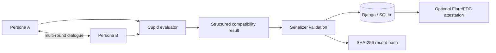

# OneSoul.AI

An experimental Django prototype exploring **AI-mediated matchmaking**: two persona agents converse, a separate evaluator produces a structured compatibility result, the result is persisted with a deterministic hash, and an optional Flare/FDC path can attest selected fields.

> **Status:** hackathon/product prototype. Several screens are mockups or partially wired. Compatibility scores are model-generated opinions, not validated psychological measurements, and the Flare path is an experimental integration rather than a production trust system.

## System in one diagram



The project combines an **agent-to-agent interaction**, a separate evaluator, persistence/provenance, and an external verification path in one application.

## Key components

| File | Responsibility |
| --- | --- |
| [`main/views.py`](main/views.py) | persona/evaluator orchestration and API flow |
| [`main/models.py`](main/models.py) | persisted profile/conversation state and result hashing |
| [`main/serializers.py`](main/serializers.py) | compatibility-score and match validation boundary |
| [`main/access.py`](main/access.py) | POST/CSRF boundary for public mutation/model endpoints |
| [`main/flare_verification.py`](main/flare_verification.py) | experimental FDC/contract attestation flow |
| [`main/tests.py`](main/tests.py) | deterministic serializer/hash regression tests |
| [`main/migrations/`](main/migrations/) | reproducible application schema |
| [`.github/workflows/tests.yml`](.github/workflows/tests.yml) | Django checks, migration-drift check and Python 3.11/3.12 tests |

The committed SQLite development database has been removed from the maintained source tree; a fresh local database is created through Django migrations.

## Main flow

1. A browser starts the demo with two predefined persona configurations.
2. Each persona receives the accumulated conversation and generates a response.
3. After the configured rounds, a separate evaluator receives the transcript and returns a structured result such as compatibility, score, summary and first-date suggestion.
4. The API validation boundary rejects self-matches and constrains compatibility scores to the UI's documented `0–100` range.
5. Django persists the conversation/result and computes a SHA-256 hash over the record fields.
6. If the Flare integration is configured, selected fields can be packaged into a JSON API attestation and submitted to the configured contract path.

The record hash only establishes integrity relative to the exact serialized fields used to compute it; it does **not** establish that the evaluator's judgement is objectively correct.

## Local setup

```bash
python -m venv .venv
# Windows: .venv\Scripts\activate
# Unix/macOS: source .venv/bin/activate
pip install -r requirements.txt
cp .env.example .env
python manage.py migrate
python manage.py test
python manage.py runserver
```

Relevant environment configuration includes Django/model-provider settings and, for Flare/FDC experiments, the RPC URL, contract address, private key, verifier/data-availability endpoints and API key.

Never commit a private key or `.env` file.

## Repository structure

```text
main/
  migrations/          schema history
  static/
  templates/
  access.py            public POST/CSRF wrapper
  flare_verification.py
  models.py
  serializers.py
  tests.py
  urls.py
  views.py
onesoul_test/          Django project configuration
.github/workflows/     deterministic CI
manage.py
requirements.txt
```

## Verification currently automated

The deterministic test layer intentionally avoids live model/RPC calls and checks invariants that can be established locally:

- compatibility scores outside `0–100` are rejected;
- a profile cannot be matched with itself through the serializer;
- a valid result can be persisted;
- the conversation hash is stable for the same semantic record;
- changing the scored outcome changes the hash;
- Django system checks and migration drift are checked on Python 3.11 and 3.12.

This is a much narrower claim than “the matchmaking system is correct”: the tests establish data-contract and provenance behavior, not psychological validity.

## Flare/FDC path

The experimental verification path:

1. prepares an `IJsonApi` / `WEB2` attestation request;
2. asks the configured verifier to ABI-encode the request;
3. submits the request to the configured contract;
4. derives a voting round;
5. retrieves the proof/response from the configured data-availability service;
6. submits the proof to the contract.

This path can create blockchain transactions and depends on external network/contract assumptions. Check transaction value, network, contract addresses and keys before executing it. It should not be enabled by default in an ordinary local demo.

## Security, privacy and product limitations

A matchmaking application can involve highly sensitive profile and relationship data. This prototype should not be deployed without redesigning data collection and privacy controls.

Current limitations include:

- model-generated compatibility is not a validated measure of relationship quality;
- demographic/profile fields should be minimized rather than collected because they are convenient;
- persona simulation can encode stereotypes or amplify prompt assumptions;
- the demo has no mature authentication/authorization model; the maintained public mutation/model routes now enforce POST + normal Django CSRF semantics, but that is not a substitute for identity/access control;
- the chain attestation proves a particular record/proof flow, not the truth of the underlying social judgement;
- external model, FDC and RPC dependencies make true end-to-end tests non-deterministic;
- the legacy `views.py` still instantiates the OpenAI SDK client at module import, so deterministic CI supplies a non-live placeholder credential even though it never calls a model-backed endpoint; lazy provider construction is a remaining cleanup item;
- product screens and endpoints are at different levels of completeness.

## Future work

Useful next steps are to decouple conversation generation, evaluation and verification into explicit service interfaces; move provider-client construction behind those interfaces; schema-validate the evaluator response before it reaches presentation logic; make chain submission opt-in and testnet-only by default; add mocked service-level tests for the full conversation→evaluation→hash path; and replace broad profile collection with the minimum data actually required by the experiment.
