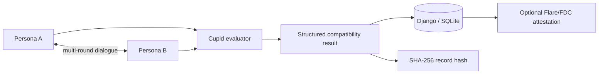

# OneSoul.AI

An experimental Django prototype exploring **AI-mediated matchmaking**: two persona agents converse, a separate evaluator produces a structured compatibility result, the result is persisted with a deterministic hash, and an optional Flare/FDC path can attest selected fields.

> **Status:** hackathon/product prototype. Several screens are mockups or partially wired. Compatibility scores are model-generated opinions, not validated psychological measurements, and the Flare path is an experimental integration rather than a production trust system.

## System in one diagram



The project is interesting less because of the matchmaking claim than because it combines an **agent-to-agent interaction**, a separate evaluator, persistence/provenance, and an external verification path in one application.

## Reviewer guide

| File | What to inspect |
| --- | --- |
| [`main/views.py`](main/views.py) | persona/evaluator orchestration and API flow |
| [`main/models.py`](main/models.py) | persisted profile/conversation state and result hashing |
| [`main/serializers.py`](main/serializers.py) | API validation boundary |
| [`main/flare_verification.py`](main/flare_verification.py) | experimental FDC/contract attestation flow |
| [`main/urls.py`](main/urls.py) | product/API surface |
| [`main/templates/`](main/templates/) | server-rendered demo UI |

The committed SQLite development database has been removed from the maintained source tree; a fresh local database should be created through Django migrations.

## Main flow

1. A browser starts the demo with two predefined persona configurations.
2. Each persona receives the accumulated conversation and generates a response.
3. After the configured rounds, a separate evaluator receives the transcript and returns a structured result such as compatibility, score, summary and first-date suggestion.
4. Django persists the conversation/result and computes a SHA-256 hash over the record fields.
5. If the Flare integration is configured, selected fields can be packaged into a JSON API attestation and submitted to the configured contract path.

The record hash only establishes integrity relative to the exact serialized fields used to compute it; it does **not** establish that the evaluator's judgement is objectively correct.

## Local setup

```bash
python -m venv .venv
# Windows: .venv\Scripts\activate
# Unix/macOS: source .venv/bin/activate
pip install -r requirements.txt
python manage.py migrate
python manage.py runserver
```

Create a local `.env` for optional integrations. Relevant configuration includes model-provider credentials and, for Flare/FDC experiments, the RPC URL, contract address, private key, verifier/data-availability endpoints and API key.

Never commit a private key or `.env` file.

## Repository structure

```text
main/
  migrations/
  static/
  templates/
  flare_verification.py
  models.py
  serializers.py
  urls.py
  views.py
onesoul_test/        Django project configuration
manage.py
requirements.txt
```

## Flare/FDC path

The experimental verification path:

1. prepares an `IJsonApi` / `WEB2` attestation request;
2. asks the configured verifier to ABI-encode the request;
3. submits the request to the configured contract;
4. derives a voting round;
5. retrieves the proof/response from the configured data-availability service;
6. submits the proof to the contract.

This path can create blockchain transactions and depends on external network/contract assumptions. Review transaction value, network, contract addresses and keys before executing it. It should not be enabled by default in an ordinary local demo.

## Privacy and product limitations

A matchmaking application can involve highly sensitive profile and relationship data. This prototype should not be deployed without redesigning data collection and privacy controls.

Current limitations include:

- model-generated compatibility is not a validated measure of relationship quality;
- demographic/profile fields should be minimized rather than collected because they are convenient;
- persona simulation can encode stereotypes or amplify prompt assumptions;
- the demo has no mature authentication/authorization model;
- the chain attestation proves a particular record/proof flow, not the truth of the underlying social judgement;
- external model, FDC and RPC dependencies make end-to-end tests non-deterministic;
- product screens and endpoints are at different levels of completeness.

## Best next engineering work

I would decouple conversation generation, evaluation and verification into explicit service interfaces; validate evaluator output with a schema; make chain submission opt-in and testnet-only by default; add deterministic fixtures for the full conversation→evaluation→hash path; and replace broad profile collection with the minimum data actually required by the experiment.
